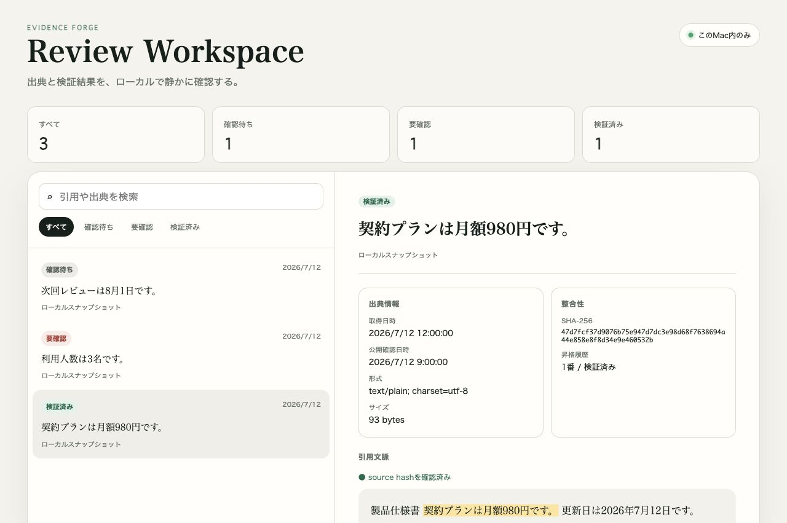

# Evidence Forge

Evidence Forge helps researchers, auditors, and AI-tool builders turn a
source-backed observation into locally verifiable Evidence. It keeps the source
snapshot, exact quote, availability time, and integrity binding together so a
reviewer can distinguish “someone observed this” from “this passed an explicit
promotion gate.”

Evidence Forge stores immutable source snapshots, records exact citation
selectors, and refuses promotion when source integrity or citation verification
fails. **An observation is only a candidate; promotion is always explicit.**

> **Installation status:** this repository is currently private and the package
> has `private: true`; it is not published to npm. Clone it from an account with
> access. pnpm is the supported package manager.

## Shortest path

Requires Node.js 24.4 or newer. The repository pins pnpm 11.0.8; if `corepack`
is unavailable but that pnpm version is already installed, skip the
`corepack enable` line. Start with the local-only tutorial, whose portable
packet and path-free result are deterministic:

```bash
git clone https://github.com/Kota-Ohno/evidence-forge-oss.git
cd evidence-forge-oss
corepack enable
pnpm install --frozen-lockfile --ignore-scripts
pnpm --silent quickstart --directory ./my-first-evidence
```

The directory must not already exist. The command creates private local tutorial
files for capture, explicit promotion, portable packet export, and offline
verification. It does not access the network, overwrite an existing directory,
print the source text, or claim trusted time.
The `--silent` flag also prevents pnpm from echoing a caller-supplied output
path; the application result itself contains artifact names, IDs, and hashes
but no absolute local path.

For your own local text file, create and verify a portable packet with one
repository command:

```bash
pnpm --silent forge \
  --source notes.txt \
  --exact "A uniquely identifying quote" \
  --available-at 2026-07-11T00:00:00Z \
  --directory ./my-evidence \
  --promote-immediately
```

The output directory must be new. `--promote-immediately` explicitly
preauthorizes promotion before the Candidate exists; this shortest path does
not pause for human Candidate inspection. The command runs locally, creates a
private candidate, VerifiedEvidence, portable packet, and packet verification,
and prints only a path-free result. Use the separate commands below when you
need to inspect a Candidate before promotion or retain multiple records in the
SQLite Review Workspace.
Keep `--silent` so pnpm itself does not echo the source path or exact quote.

Installed-package equivalent: `evidence-forge forge-local` with the same
options. The repository alias performs a safe incremental stale-source check
before starting the single-process Evidence workflow.

To run the same critical transition manually:

```bash
pnpm build

printf '%s\n' 'A uniquely identifying quote' > notes.txt
pnpm capture \
  --workspace .evidence-forge \
  --source notes.txt \
  --exact "A uniquely identifying quote" \
  --available-at 2026-07-11T00:00:00Z \
  --database .evidence-forge/workspace.sqlite \
  --out candidate.json
pnpm promote \
  --candidate candidate.json \
  --database .evidence-forge/workspace.sqlite \
  --out evidence.json
```

`capture` creates a Candidate and retains its content-addressed snapshot.
`promote` rechecks the snapshot, exact quote, context, and timestamps before it
can create VerifiedEvidence. For the complete operational workflow, use the
[operator runbook](docs/OPERATOR.md).

## Everyday workflows

- Capture a local file, then explicitly promote only the candidates you accept.
- Capture bounded public HTTP(S) content, preview citation matching offline, and
  cite the retained response without refetching it.
- Review candidates, rejected attempts, and verified Evidence in the local
  Review Workspace backed by SQLite.
- Export a portable packet for standalone offline verification against a digest
  retained through a separate channel.

The detailed commands and contracts remain below; start with local
`capture → promote`, then add web capture, Review Workspace, or packet export only
when the use case needs them.

## Role in the ecosystem

Evidence Forge is the evidence-authoring and promotion layer.
[Agent Black Box](https://github.com/Kota-Ohno/agent-black-box-oss) records
privacy-bounded execution observations, and
[Sol Ledger Protocol](https://github.com/Kota-Ohno/sol-ledger-protocol-oss)
provides shared provenance contracts. The
[Ecosystem Acceptance Kit](https://github.com/Kota-Ohno/ecosystem-acceptance-kit-oss)
checks exact private revisions and packed behavior together.

## Safety limits

- Promotion verifies source and citation consistency; it does not prove that the
  source was truthful, unbiased, or legally usable.
- Local wall-clock timestamps are not trusted timestamps. External anchors,
  signer trust, retention, and independent review remain operator responsibilities.
- Web capture performs network access and denies non-public targets by default;
  do not enable private-address access for untrusted URLs.
- Keep workspaces, source snapshots, private keys, and trusted heads private.
  Read the [trust-boundary audit](docs/TRUST-AUDIT.md) before making assurance
  claims and [release readiness](docs/RELEASE-READINESS.md) before publication.



## Development

```bash
pnpm install
pnpm check
```

After installing a packed release, verify its core local workflow without
providing source data or creating a durable workspace:

```bash
evidence-forge-self-test run
```

The command generates one fixed non-user fixture in a private temporary
directory, performs local capture, explicit promotion, portable packet export
and verification, and capability discovery, then removes the entire directory
on success or failure. It opens no network-capable workflow, SQLite database,
or listener. The closed summary contains only package version, completed-check
booleans, and explicit scope limits—never the fixture, generated IDs, digests,
timestamps, or paths. Its contract is
[`offline-installed-self-test.schema.json`](schemas/offline-installed-self-test.schema.json).

After `pnpm build`, a complete local flow is:

```bash
node dist/src/cli.js capture \
  --workspace .evidence-forge \
  --source notes.txt \
  --exact "A uniquely identifying quote" \
  --available-at 2026-07-11T00:00:00Z \
  --database .evidence-forge/workspace.sqlite \
  --out candidate.json
node dist/src/cli.js promote \
  --candidate candidate.json \
  --database .evidence-forge/workspace.sqlite \
  --out evidence.json
```

The optional shared database makes the candidate, rejected attempts, and
verified Evidence immediately visible in Review Workspace. Omit `--database`
to retain the original file-only capture and promotion flow.

Capture a remote HTTP(S) response into the same durable workspace as a raw
local observation (never automatic Evidence), then explicitly cite its retained
decoded snapshot without fetching the URL again:

```bash
node dist/src/cli.js capture-web \
  --workspace .evidence-forge \
  --url https://example.com/source \
  --database .evidence-forge/workspace.sqlite \
  --out web-capture.json

node dist/src/cli.js cite-web \
  --capture web-capture.json \
  --exact "Exact text retained in the response" \
  --database .evidence-forge/workspace.sqlite \
  --out web-candidate.json

node dist/src/cli.js promote \
  --candidate web-candidate.json \
  --database .evidence-forge/workspace.sqlite \
  --out web-evidence.json
```

When a quote copied from a rendered page does not preserve the retained HTML
view's block whitespace, preview it offline before creating a Candidate:

```bash
node dist/src/cli.js preview-citation \
  --capture web-capture.json \
  --database .evidence-forge/workspace.sqlite \
  --query "distinctive text copied from the page" \
  --out citation-preview.json

node dist/src/cli.js cite-web \
  --capture web-capture.json \
  --database .evidence-forge/workspace.sqlite \
  --query "distinctive text copied from the page" \
  --out web-candidate.json
```

The preview revalidates the persisted capture and retained snapshot, performs no
network request, and creates neither a Candidate nor Evidence. It tries an exact
match first and then a whitespace-normalized match, but always returns the actual
source-exact text. `cite-web --query` succeeds only when that lookup is unique.
Use `--exact` when the canonical quote is already known; the two options cannot
be combined.

Web capture follows bounded redirects, retains both wire and decoded
content-addressed artifacts, and defaults to denying non-public network targets.
Use `--allow-private-addresses` only for an explicitly trusted intranet or local
source. `cite-web` requires an exact match with the capture already stored in the
selected database, rechecks the retained snapshot's regular-file status, size,
hash, and UTF-8 decoding, and never performs network I/O. Repeating the same
capture and exact quote converges on the same candidate ID.
For `text/html`, citation matching uses a bounded, script-free plain-text view
derived offline with the versioned `evidence-forge/html-text@1` transformation.
The candidate and Evidence bind that view's digest to the decoded HTML digest;
the original decoded HTML bytes remain the source of record and are re-derived
at promotion and review time. Unsupported charsets, fatal truncation, oversized
views, missing bindings, and changed derived output fail closed.
The portable record is defined by the closed
[`schemas/citation-view.schema.json`](schemas/citation-view.schema.json), is
advertised with its SHA-256 by `evidence-forge capabilities`, and is validated
at runtime before promotion, review, or Sol Ledger export.
The enclosing candidate and VerifiedEvidence records are likewise defined by
closed [`schemas/evidence-candidate.schema.json`](schemas/evidence-candidate.schema.json)
and [`schemas/verified-evidence.schema.json`](schemas/verified-evidence.schema.json).
CLI and SQLite boundaries validate these complete envelopes before use, so
unknown fields, malformed nested selectors or snapshots, null view bindings,
and inconsistent timestamp order do not rely on TypeScript types to fail closed.

Export one verified citation for standalone offline transfer:

```bash
evidence-forge export-packet --candidate candidate.json --evidence evidence.json --out evidence-packet.json
evidence-forge inspect-packet-head --packet evidence-packet.json --out packet-head.json
evidence-forge verify-packet --packet evidence-packet.json --expected-sha256 PACKET_SHA256
```

`inspect-packet-head` safely distinguishes the packet's embedded and recomputed
JCS payload head from the SHA-256 of the formatted JSON file. It does not accept
an external anchor, decode or rehash source bytes, replay promotion, verify the
packet, or attest time. Use the inspected packet head only as a value to retain
through an independent channel; use `verify-packet` with that externally retained
head for actual verification.

The closed [`schemas/evidence-packet.schema.json`](schemas/evidence-packet.schema.json)
artifact carries at most 16 MiB of source bytes under the fixed logical name
`source.bin`. It replaces local object paths and source URIs with packet-local
references, retains the source digest, selector, derived HTML view, and envelope
timestamps, and replays the promotion gate in a private temporary workspace.
Unknown fields, source mutation, cross-record substitution, unsafe names, and a
wrong externally pinned packet head fail without exposing the temporary path.

Review a pinned packet without opening or creating a workspace database:

```bash
evidence-forge review \
  --evidence-packet evidence-packet.json \
  --evidence-packet-sha256 PACKET_SHA256
```

The packet and external head are verified before the loopback listener starts.
Packet review cannot be mixed with a database, exposes only bounded citation
context through the existing one-request bootstrap, and labels the source as a
portable offline record without revealing its former path or URI. Its closed
detail projection is packaged as
[`schemas/review-evidence-packet.schema.json`](schemas/review-evidence-packet.schema.json).

Bind and audit an ordered offline collection of up to 100 packets:

```bash
evidence-forge create-packet-index \
  --packet first.packet.json --expected-packet-sha256 FIRST_PACKET_SHA256 \
  --packet second.packet.json --expected-packet-sha256 SECOND_PACKET_SHA256 \
  --out packet-index.json
evidence-forge audit-packet-collection \
  --packet-index packet-index.json --packet-index-sha256 PACKET_INDEX_SHA256 \
  --packet first.packet.json --packet second.packet.json \
  --out packet-audit.json
evidence-forge review \
  --evidence-packet-index packet-index.json \
  --evidence-packet-index-sha256 PACKET_INDEX_SHA256 \
  --evidence-packet-audit-receipt packet-audit.json \
  --evidence-packet-audit-receipt-sha256 PACKET_AUDIT_SHA256 \
  --evidence-packet first.packet.json \
  --evidence-packet second.packet.json
```

Index creation requires one separately retained head per packet. The collection
is limited to 64 MiB of decoded source bytes in addition to its 100-packet cap.
The closed
[`schemas/evidence-packet-index.schema.json`](schemas/evidence-packet-index.schema.json)
chains packet order and bounded record identities; the standalone audit reloads
every source and rejects missing, unexpected, duplicate, reordered, mutated, or
metadata-substituted packets. Its closed receipt is
[`schemas/evidence-packet-collection-audit-receipt.schema.json`](schemas/evidence-packet-collection-audit-receipt.schema.json).
Collection review replays the audit before listener startup and exposes the
verified records through the same searchable, one-hierarchy UI without packet
paths or original source URIs.

Append one new packet without rebuilding or modifying the pinned current index:

```bash
evidence-forge append-packet-index \
  --current-index packet-index.json \
  --current-index-sha256 PACKET_INDEX_SHA256 \
  --packet next.packet.json \
  --expected-packet-sha256 NEXT_PACKET_SHA256 \
  --out next-packet-index.json
```

The append verifies both external heads, preserves every prior entry byte-for-byte
inside the new index, and adds exactly one chained entry. Stale current heads,
duplicate packet/candidate/Evidence identities, the 100-entry limit, the 64 MiB
aggregate source limit, and output overwrite attempts fail closed. Re-run the
full collection audit against `next-packet-index.json` before review.

Verify a retained audit without opening any source packet:

```bash
evidence-forge verify-packet-collection \
  --packet-index packet-index.json --packet-index-sha256 PACKET_INDEX_SHA256 \
  --packet-audit-receipt packet-audit.json \
  --packet-audit-receipt-sha256 PACKET_AUDIT_SHA256
```

The closed path-free projection reports the verified count, aggregate source
bytes, first/last packet heads, and both pinned artifact heads. It does not
re-verify source bytes and does not claim a trusted timestamp; use the full
audit when the packet files are available.

Bundle the pinned index, retained audit receipt, and complete ordered packet
collection into one externally pinned file:

```bash
evidence-forge export-packet-collection-bundle \
  --packet-index packet-index.json --packet-index-sha256 PACKET_INDEX_SHA256 \
  --packet-audit-receipt packet-audit.json \
  --packet-audit-receipt-sha256 PACKET_AUDIT_SHA256 \
  --packet first.packet.json --packet second.packet.json \
  --out packet-collection.bundle.json
evidence-forge verify-packet-collection-bundle \
  --bundle packet-collection.bundle.json --expected-sha256 BUNDLE_SHA256
evidence-forge review \
  --evidence-packet-bundle packet-collection.bundle.json \
  --evidence-packet-bundle-sha256 BUNDLE_SHA256
```

The closed bundle is capped at 192 MiB and uses only digest-derived logical
packet names. Verification replays the index, receipt, every source/selector/
Evidence binding, order, and bundle head in memory; Review Workspace consumes
the verified bundle directly without extraction or source path disclosure.

Append one or more externally pinned packets directly to an externally pinned
bundle with one current-bundle verification:

```bash
evidence-forge append-packet-collection-bundle \
  --current-bundle packet-collection.bundle.json \
  --current-bundle-sha256 BUNDLE_SHA256 \
  --packet next.packet.json \
  --expected-packet-sha256 NEXT_PACKET_SHA256 \
  --packet another.packet.json \
  --expected-packet-sha256 ANOTHER_PACKET_SHA256 \
  --out next-packet-collection.bundle.json
```

The command fully verifies the current bundle and new packet before creating a
new file. Each `--packet` is paired by position with one expected head. The
current bundle is replayed once, input order is preserved, and all prior index
entries and packet records remain exact while the chained entries, collection
audit, and bundle heads are recomputed in memory. Missing anchors, stale heads,
duplicates within either collection, count or source-size overflow, bundle-size
overflow, and output overwrite fail closed; no intermediate file is created and
the current bundle is never extracted or modified.

Independently prove that two pinned bundles form one exact append transition:

```bash
evidence-forge audit-packet-collection-bundle-transition \
  --previous-bundle packet-collection.bundle.json \
  --previous-bundle-sha256 PREVIOUS_BUNDLE_SHA256 \
  --next-bundle next-packet-collection.bundle.json \
  --next-bundle-sha256 NEXT_BUNDLE_SHA256 \
  --out packet-collection-transition-audit.json
```

Both bundles are fully replayed before the closed receipt is written. The audit
requires every previous index entry and packet record to remain exact and the
next bundle to add 1–99 ordered records. The path-free receipt binds both bundle
and index heads, previous/next counts, appended sequence range and endpoint
packet heads, and explicitly reports that its timestamp is not attested.

When only the retained receipt is available, verify its external head and
internal invariants without reopening either bundle:

```bash
evidence-forge verify-packet-collection-transition \
  --receipt packet-collection-transition-audit.json \
  --expected-sha256 TRANSITION_AUDIT_SHA256
```

The bounded projection reports the previous/next bundle heads, counts, appended
sequence range and endpoint packet heads. `bundlesReaudited: false` and
`timestampAttested: false` make its deliberately lighter assurance explicit.
Mutation, unknown fields, stale heads, reversed ranges, and inconsistent counts
fail closed.

Chain multiple pinned transition receipts into one continuous history:

```bash
evidence-forge create-packet-transition-history \
  --receipt transition-1.json --expected-receipt-sha256 TRANSITION_1_SHA256 \
  --receipt transition-2.json --expected-receipt-sha256 TRANSITION_2_SHA256 \
  --out packet-transition-history.json
evidence-forge append-packet-transition-history \
  --current-index packet-transition-history.json \
  --current-index-sha256 HISTORY_SHA256 \
  --receipt transition-3.json --expected-receipt-sha256 TRANSITION_3_SHA256 \
  --out next-packet-transition-history.json
evidence-forge verify-packet-transition-history \
  --index next-packet-transition-history.json --expected-sha256 NEXT_HISTORY_SHA256
```

Every adjacent receipt must connect the exact bundle head, index head, and
packet count. Each entry is hash-chained and the current index remains
byte-for-byte unchanged during append. Gaps, rollback, forks, duplicates,
out-of-order input, stale heads, overwrite, and the 99-transition limit fail
closed. The index contains no packet contents, paths, identities, or trusted
timestamp claim.

Audit the complete ordered receipt collection against a pinned history index:

```bash
evidence-forge audit-packet-transition-history \
  --index packet-transition-history.json --index-sha256 HISTORY_SHA256 \
  --receipt transition-1.json --receipt transition-2.json \
  --out packet-transition-history-audit.json
```

Every receipt is bounded and self-verified, then matched to its exact indexed
head and bundle/index/count projection. Missing, unexpected, duplicate,
reordered, mutated, or cross-history receipts fail closed. The closed audit
receipt binds the history head, transition count, initial/latest bundle heads,
initial/latest packet counts and endpoint transition heads without retaining
paths or claiming trusted time.

Verify a retained history-audit receipt without reopening the history or its
transition receipts:

```bash
evidence-forge verify-packet-transition-history-audit \
  --audit-receipt packet-transition-history-audit.json \
  --expected-sha256 HISTORY_AUDIT_SHA256
```

The closed projection carries the history head, coverage endpoints, counts and
endpoint transition heads. It explicitly reports `collectionReaudited: false`
and `timestampAttested: false`. Mutation, unknown fields, stale heads,
impossible count coverage, equal endpoint bundles, and endpoint-transition
inconsistency fail closed.

Review the pinned history index and its matching audit receipt locally:

```bash
evidence-forge review --database .evidence-forge/workspace.sqlite \
  --packet-transition-history-index packet-transition-history.json \
  --packet-transition-history-index-sha256 HISTORY_SHA256 \
  --packet-transition-history-audit-receipt packet-transition-history-audit.json \
  --packet-transition-history-audit-receipt-sha256 HISTORY_AUDIT_SHA256
```

All four history inputs are required together and are cross-checked before the
loopback listener starts. The browser receives bounded counts and endpoint
heads only; it receives no paths, packet contents, identities, collection
re-audit claim, or trusted-time claim.

Add `--evidence-packet-bundle` and `--evidence-packet-bundle-sha256` to review
the current portable collection at the same time. Its exact bundle head and
packet count must equal the verified history's latest endpoint before startup;
a lagging or unrelated valid bundle fails closed. A match produces one combined
current-record/history card rather than two independent success claims.

Carry that complete current collection and its audited append lineage as one
externally pinned artifact:

```bash
evidence-forge export-packet-collection-lineage \
  --evidence-packet-bundle packet-collection.bundle.json \
  --evidence-packet-bundle-sha256 BUNDLE_SHA256 \
  --packet-transition-history-index packet-transition-history.json \
  --packet-transition-history-index-sha256 HISTORY_SHA256 \
  --packet-transition-history-audit-receipt packet-transition-history-audit.json \
  --packet-transition-history-audit-receipt-sha256 HISTORY_AUDIT_SHA256 \
  --receipt transition-1.json --expected-receipt-sha256 TRANSITION_1_SHA256 \
  --receipt transition-2.json --expected-receipt-sha256 TRANSITION_2_SHA256 \
  --out packet-collection.lineage.json
evidence-forge verify-packet-collection-lineage \
  --lineage packet-collection.lineage.json --expected-sha256 LINEAGE_SHA256
evidence-forge review \
  --evidence-packet-lineage packet-collection.lineage.json \
  --evidence-packet-lineage-sha256 LINEAGE_SHA256
```

The closed lineage file is capped at 196 MiB. Verification replays the current
collection and the complete ordered transition-receipt audit in memory, then
requires the collection head and packet count to equal the history's latest
endpoint. Digest-derived transition names prevent traversal and substitution;
missing, duplicate, reordered, cross-history, mutated, or endpoint-mismatched
records fail closed without extraction. Review reuses the same bounded M102
combined card and current packet list. The standalone verifier's
`historyCollectionReaudited: true` refers only to the embedded records; neither
surface adds identity trust or a trusted timestamp.

Advance a pinned lineage by one already-audited collection transition without
extracting or rebuilding its retained history:

```bash
evidence-forge append-packet-collection-lineage \
  --current-lineage packet-collection.lineage.json \
  --current-lineage-sha256 LINEAGE_SHA256 \
  --next-bundle next-packet-collection.bundle.json \
  --next-bundle-sha256 NEXT_BUNDLE_SHA256 \
  --transition-receipt next-transition.json \
  --transition-receipt-sha256 NEXT_TRANSITION_SHA256 \
  --out next-packet-collection.lineage.json
```

The command fully verifies each pinned input, recomputes the exact append
receipt from the embedded current and supplied next collections, extends the
hash-chained history, and rebuilds its complete receipt audit in memory. Every
prior history entry and transition record remains exact. Stale anchors,
unrelated, reversed, or duplicate transitions, count/size overflow, and output
overwrite fail closed; all inputs remain byte-for-byte unchanged.

When the next collection bundle and transition receipt do not already exist,
append pinned packets directly to the lineage in one operation:

```bash
evidence-forge append-packets-to-collection-lineage \
  --current-lineage packet-collection.lineage.json \
  --current-lineage-sha256 LINEAGE_SHA256 \
  --packet next.packet.json --expected-packet-sha256 NEXT_PACKET_SHA256 \
  --packet another.packet.json --expected-packet-sha256 ANOTHER_PACKET_SHA256 \
  --out next-packet-collection.lineage.json
```

The current lineage is fully verified once. Packets are appended in caller
order and the next collection bundle, exact transition receipt, hash-chained
history entry, complete receipt audit, and lineage head are derived in memory.
No next-bundle, transition-receipt, extraction, or intermediate file is written.
Anchor-count mismatch, stale lineage, duplicate identities, count/source/bundle/
lineage overflow, and output collision fail closed without changing any input.

Open the read-only local Review Workspace for the same durable SQLite database:

```bash
node dist/src/cli.js review \
  --database .evidence-forge/workspace.sqlite \
  --stack-report .evidence-forge/run-1/report.json \
  --stack-report .evidence-forge/run-2/report.json
```

The server binds only to `127.0.0.1`. It shows candidate state, verified source
context, promotion failures, Evidence records, and append-only history without
offering any write action. The optional validated stack report adds the three
repository revisions, clean/changed state, event count, and up to 20 validated
historical results ordered newest-first.
Web-derived items are labeled separately. Their detail view verifies the unique
persisted capture linkage and shows query-redacted requested/canonical URLs,
redirect count, HTTP status, retrieval metadata, and an explicit offline replay
assurance in a keyboard-accessible disclosure. Missing, duplicate, inconsistent,
or tampered capture linkage fails closed without exposing object paths.
For HTML, the context is labeled as derived text and explains that the retained
HTML bytes—not the displayed text—remain the source of record.
The eight most recent entries are keyboard-accessible buttons; selecting one
shows exact per-product commit changes against its preceding run.

Run the complete private stack acceptance flow with local checkouts of the other
two repositories:

```bash
pnpm dogfood:stack \
  --agent-black-box ../agent-black-box \
  --sol-ledger ../sol-ledger-protocol \
  --output .evidence-forge/stack-run
```

The output directory must not already exist. The command records capture and
promotion with Agent Black Box, rejects traces containing source or path text,
verifies the trusted head with Sol Ledger's Rust CLI, and writes a bounded
`report.json`.
New reports include a `sha256-jcs` integrity record. Review Workspace verifies
it before opening the database; legacy reports without integrity remain
readable. The public contract is
[`schemas/stack-acceptance-report.schema.json`](schemas/stack-acceptance-report.schema.json).
For revision-pinned clean-room orchestration, upgrade preflight, and retained
outer receipts across all three private repositories, use the separate
[`ecosystem-acceptance-kit-oss`](https://github.com/Kota-Ohno/ecosystem-acceptance-kit-oss)
`v0.2.0`; this repository command remains the underlying product acceptance.

Optionally create a detached local Ed25519 signature with a pre-existing 0600
private key (the key is read locally and never copied into output):

```bash
pnpm sign:report --report report.json --private-key signer-a-private.pem --out report.a.sig.json
pnpm sign:report --report report.json --private-key signer-b-private.pem --out report.b.sig.json
node dist/src/cli.js review --database workspace.sqlite --stack-report report.json \
  --stack-signature report.a.sig.json --stack-signature report.b.sig.json \
  --trusted-public-key signer-a-public.pem --trusted-public-key signer-b-public.pem \
  --signature-threshold 2 \
  --trust-valid-from 2026-07-13T00:00:00.000Z \
  --trust-valid-until 2026-10-13T00:00:00.000Z
```

Only explicitly supplied public keys are trusted. The threshold counts distinct
valid signers; duplicate, invalid, untrusted, or revoked signatures fail closed.
The optional canonical ISO validity window is checked when Review Workspace
starts. Add `--revoked-key-id SHA256` to reject a formerly trusted key. A single
signature remains supported by omitting `--signature-threshold`.

To move the report, signatures, and public keys as one bounded private file,
create a portable review bundle. Private keys are never included. Trust still
comes from key IDs obtained through an independent channel, not from keys merely
present inside the bundle:

```bash
pnpm bundle:report --report report.json \
  --signature report.a.sig.json --signature report.b.sig.json \
  --public-key signer-a-public.pem --public-key signer-b-public.pem \
  --out review.bundle.json
node dist/src/cli.js review --database workspace.sqlite \
  --stack-bundle review.bundle.json \
  --trusted-key-id SIGNER_A_SHA256 --trusted-key-id SIGNER_B_SHA256 \
  --signature-threshold 2
```

The closed JSON bundle is capped at 1 MiB, written as `0600`, JCS-hashed, and
contains no source content or local paths. Its embedded keys are transport
material only; omitting the external trusted key IDs fails closed.

For long-term release retention, `evidence-forge-release-pack` combines the
package tarball, signed provenance, detached review material, schemas, and a
human summary into one private bounded file. Verification requires an
independently retained pack digest and provenance signer key ID; extraction
creates only fixed-name private files in a new directory. See the
[operator runbook](docs/OPERATOR.md#durable-release-evidence-pack).
Multiple verified packs can be tracked with `evidence-forge-release-index`; its
externally pinned current digest makes release omission and rollback visible
without opening every pack during routine inventory checks.
`evidence-forge-audit-archive` performs the deeper periodic pass: it requires the
pinned index head, rejects collection mismatch, and revalidates every supplied
pack while emitting only a bounded path-free receipt.
Archive CLI failures include bounded stable codes beside path-redacted human
messages, so automation can reject omission and rollback without parsing prose.
Every installed CLI also accepts `--error-format json` to emit a closed,
4 KiB-capped `EvidenceForgeCliError` object on stderr while retaining a nonzero
exit status. Default human-readable failures remain unchanged.
Agents and operator tooling can run `evidence-forge capabilities` to discover
the installed package version, all binaries, the global error contract, and
SHA-256-pinned packaged schemas without probing commands or source paths.
Two retained manifests can be checked offline with `evidence-forge
compare-capabilities`; removals and schema/error-contract mutations are treated
as breaking, produce a closed path-free receipt, and exit with status 2.
For release rehearsal, `pnpm acceptance:capabilities --help` verifies two
signed release packs, installs each generation independently, and exercises the
comparison through the newer packed CLI rather than repository imports.
Compatibility receipts also report required and actual SemVer bump. An
insufficient bump exits 3; a correctly major-versioned breaking transition
still exits 2 because release policy compliance does not restore compatibility.
`evidence-forge-upgrade-evidence` can then bind both pinned manifests and their
exact receipt into one owner-only artifact. Verification needs only that file
and its independently retained SHA-256; it rechecks every embedded integrity
head and cross-link without installed copies of either package.
`evidence-forge-bind-upgrade` closes the remaining release link: it verifies two
signed packs, installs their package artifacts offline with lifecycle scripts
disabled, runs only each `capabilities` binary, and requires both results to
equal the manifests in pinned upgrade evidence before writing a path-free receipt.
Multiple binding receipts can be appended with `evidence-forge-upgrade-index`.
Each entry hash-links the previous entry and requires the shared release version
and pack head to match exactly, so a pinned latest index makes gaps, duplicates,
reordering, and valid-prefix rollback detectable.
`evidence-forge-audit-upgrades` performs the full collection check: it matches
every supplied binding receipt to a pinned history entry, rejects missing,
unexpected, or duplicate files, and revalidates all release/evidence cross-links.
Repository release rehearsal can rebuild the entire chain from three or more
signed packs with `pnpm acceptance:upgrade-archive --help`. The shell-free
command derives each adjacent installed transition, seals and binds it, builds
and audits the history, then proves omission and valid-prefix rollback rejection.
The local Review Workspace can display that upgrade continuity when both the
history index and audit receipt are supplied with independently retained expected
digests; only the verified release range, transition count, and explicit
untrusted-time marker reach the browser. Partial or mismatched input fails before
the local listener opens. The bounded response contract is versioned in
[`schemas/review-upgrade-inventory.schema.json`](schemas/review-upgrade-inventory.schema.json).

Reproduce that installed browser boundary from one externally pinned signed pack
without relying on the source checkout's CLI implementation:

```bash
pnpm acceptance:upgrade-workspace \
  --release-pack release.evidence-pack.json \
  --release-pack-sha256 EXPECTED_PACK_SHA256 \
  --release-key-id EXPECTED_PROVENANCE_KEY_ID \
  --release-index release-index.json \
  --release-index-sha256 EXPECTED_RELEASE_INDEX_SHA256 \
  --archive-audit-receipt archive-audit.json \
  --archive-audit-receipt-sha256 EXPECTED_ARCHIVE_AUDIT_SHA256 \
  --upgrade-history-index upgrade-history.json \
  --upgrade-history-index-sha256 EXPECTED_HISTORY_SHA256 \
  --upgrade-history-audit-receipt upgrade-history-audit.json \
  --upgrade-history-audit-receipt-sha256 EXPECTED_AUDIT_SHA256 \
  --output acceptance-output
```

The shell-free acceptance extracts the signed package, installs it offline with
lifecycle scripts disabled, starts its loopback-only Review Workspace, validates
the installed combined response schema, CSP, and trust-limit copy, and proves
partial, mismatched, middle-version, middle-pack-head, and lagging-history
rejection. Its owner-only `acceptance-receipt.json` binds heads, versions,
counts, and booleans under one JCS SHA-256; the closed contract is
[`schemas/packed-workspace-acceptance-receipt.schema.json`](schemas/packed-workspace-acceptance-receipt.schema.json).
`loadWorkspaceAcceptanceReceipt` requires an externally retained receipt head
and rejects mutation or unknown fields without loading any original input path.
The installed package exposes the same boundary without application code:

```bash
evidence-forge-verify-workspace-acceptance verify \
  --receipt acceptance-receipt.json \
  --expected-receipt-sha256 EXPECTED_RECEIPT_SHA256
```

The command returns only package/release versions, counts, the verified receipt
head, and `timestampAttested: false`. Add `--error-format json` for stable
automation codes; it never opens archive inputs or starts a listener.

Review Workspace can present the same pinned receipt locally:

```bash
evidence-forge review --database review.sqlite \
  --workspace-acceptance-receipt acceptance-receipt.json \
  --workspace-acceptance-receipt-sha256 EXPECTED_RECEIPT_SHA256
```

Receipt-only mode shows a bounded explanation. When archive and upgrade inputs
are also configured, every receipt archive head, release range, and count must
match the verified combined coverage before the listener starts; the browser
then adds one compact distribution-acceptance marker to the combined card. The
bounded browser contract is versioned in
[`schemas/review-workspace-acceptance.schema.json`](schemas/review-workspace-acceptance.schema.json).
`pnpm acceptance:upgrade-workspace` also reloads its newly generated receipt
through the offline-installed package in receipt-only and combined modes, and
proves partial, wrong-head, and coverage-mismatched receipt rejection.

When release-archive and upgrade-history inputs are both configured, Review
Workspace verifies more than their visible endpoints and counts. Every adjacent
release version and signed pack head in the archive must equal the corresponding
previous/current pair in the upgrade history. Exact coverage replaces the two
individual strips with one combined readiness result; a middle mismatch or a
lagging history prevents the local listener from opening. The bounded response
is versioned in
[`schemas/review-coverage-readiness.schema.json`](schemas/review-coverage-readiness.schema.json).

Create an immutable trust history when signer keys need to rotate. The initial
entry is authorized by its own externally anchored quorum. Every later entry is
signed by the immediately preceding policy, so removing an entry, reversing
time, or replacing signers without the old quorum fails closed:

```bash
pnpm rotate:trust \
  --effective-at 2026-07-13T00:00:00.000Z \
  --trusted-public-key signer-a-public.pem --trusted-public-key signer-b-public.pem \
  --signature-threshold 2 \
  --authorizing-private-key signer-a-private.pem \
  --authorizing-private-key signer-b-private.pem \
  --out trust-history-1.json

pnpm rotate:trust --history trust-history-1.json \
  --anchor-key-id INITIAL_A_SHA256 --anchor-key-id INITIAL_B_SHA256 \
  --anchor-threshold 2 --history-sha256 TRUST_HISTORY_1_SHA256 \
  --effective-at 2026-10-13T00:00:00.000Z \
  --trusted-public-key signer-b-public.pem --trusted-public-key signer-c-public.pem \
  --signature-threshold 2 \
  --authorizing-private-key signer-a-private.pem \
  --authorizing-private-key signer-b-private.pem \
  --out trust-history-2.json

node dist/src/cli.js review --database workspace.sqlite \
  --stack-bundle review.bundle.json --trust-history trust-history-2.json \
  --trust-anchor-key-id INITIAL_A_SHA256 --trust-anchor-key-id INITIAL_B_SHA256 \
  --trust-anchor-threshold 2 --trust-history-sha256 TRUST_HISTORY_2_SHA256
```

Record each output's `integrity.historySha256` through the same independent
channel as the initial key IDs and threshold. The expected head detects removal
of entries from the end of an otherwise valid chain. The active policy is
selected from canonical `effectiveAt` timestamps using the
real local clock. Future entries remain visible as scheduled rotations; callers
cannot inject a historical verification time. Private keys are only read from
0600 files and are never copied into history or browser data.

Verify the complete handoff without starting Review Workspace and emit a compact
machine-readable receipt:

```bash
pnpm --silent verify:review -- \
  --stack-bundle review.bundle.json \
  --trust-history trust-history-2.json \
  --trust-anchor-key-id INITIAL_A_SHA256 \
  --trust-anchor-key-id INITIAL_B_SHA256 \
  --trust-anchor-threshold 2 \
  --trust-history-sha256 TRUST_HISTORY_2_SHA256 \
  --out review-receipt.json
```

Without a history, repeat `--trusted-key-id` and provide an explicit
`--signature-threshold`. The receipt is closed JSON capped at 64 KiB, written as
`0600`, and contains report/bundle digests, signer counts, threshold, and bounded
rotation status without key IDs or local paths. Manual trust is committed as a
policy digest instead of exposing its keys. Receipt JCS integrity detects local
mutation; it is not a new signature or a trusted timestamp, so independent
verification still requires the original bundle and trust anchors.
The public receipt contract is
[`schemas/review-verification-receipt.schema.json`](schemas/review-verification-receipt.schema.json).

Run the named fail-closed regression matrix independently with
`pnpm failure:matrix`.

Rehearse lineage continuity across two independently pinned private releases:

```bash
pnpm acceptance:lineage \
  --older-pack older.evidence-pack.json --older-pack-sha256 OLDER_PACK_SHA256 --older-key-id OLDER_KEY_ID \
  --newer-pack newer.evidence-pack.json --newer-pack-sha256 NEWER_PACK_SHA256 --newer-key-id NEWER_KEY_ID \
  --output .evidence-forge/lineage-continuity
```

Both packages are installed offline with lifecycle scripts disabled. Only the
older installed CLI creates the initial lineage; only the newer package
verifies, directly appends, and opens its loopback Review Workspace. The
bounded `acceptance-receipt.json` binds both releases, pack heads, lineage
endpoints, counts, immutable-input checks, and fail-closed stale-head/collision
checks without paths or a trusted-time claim.

Retain the receipt with its independently recorded head. It can later be
verified without either release pack or lineage:

```bash
evidence-forge-verify-lineage-continuity verify \
  --receipt .evidence-forge/lineage-continuity/acceptance-receipt.json \
  --expected-receipt-sha256 RECEIPT_SHA256
```

This replays the receipt's JCS head, strict release order, distinct pack and
lineage endpoints, packet/transition progression, required checks, and explicit
no-trusted-time assurance. The bounded path-free projection sets
`packsReexecuted`, `lineagesReaudited`, and `timestampAttested` to `false`; it
does not substitute for rerunning the original acceptance. The packaged
contracts are
[`cross-release-lineage-acceptance-receipt.schema.json`](schemas/cross-release-lineage-acceptance-receipt.schema.json)
and
[`lineage-continuity-verification.schema.json`](schemas/lineage-continuity-verification.schema.json).

Review Workspace can show that same retained boundary without reopening either
release pack or lineage:

```bash
evidence-forge review --database review.sqlite \
  --lineage-continuity-receipt .evidence-forge/lineage-continuity/acceptance-receipt.json \
  --lineage-continuity-receipt-sha256 RECEIPT_SHA256
```

The receipt is fully verified before the loopback listener starts. The single
bootstrap response contains only release order, lineage endpoints, packet and
transition progression, the receipt head, and explicit false values for pack
re-execution, lineage re-audit, and timestamp attestation. Partial, stale,
mutated, reversed, or inconsistent input prevents the listener from opening;
local paths and pack heads never reach the browser.

When the retained boundary is meant to describe the currently reviewed
portable lineage, pass both option pairs together:

```bash
evidence-forge review \
  --evidence-packet-lineage packet-collection.lineage.json \
  --evidence-packet-lineage-sha256 LINEAGE_SHA256 \
  --lineage-continuity-receipt .evidence-forge/lineage-continuity/acceptance-receipt.json \
  --lineage-continuity-receipt-sha256 RECEIPT_SHA256
```

Before listening, Review fully verifies the portable lineage and requires its
head, packet count, and transition count to equal the receipt's newer endpoint.
A matching pair produces one combined handoff/current-collection card. A
mismatched or lagging receipt fails closed; loose bundle/history inputs cannot
be substituted for the externally pinned lineage in this combined mode. The
bootstrap schema and the standalone states remain unchanged.

Automation can verify the same current endpoint without opening Review or a
database:

```bash
evidence-forge-preflight-lineage-continuity verify \
  --lineage packet-collection.lineage.json \
  --expected-lineage-sha256 LINEAGE_SHA256 \
  --receipt .evidence-forge/lineage-continuity/acceptance-receipt.json \
  --expected-receipt-sha256 RECEIPT_SHA256
```

The installed command fully re-audits the portable lineage, verifies the
retained receipt, and requires the receipt's newer head and counts to equal the
current endpoint. Its closed projection exposes only release order, the current
lineage and receipt heads, current counts, `currentLineageReaudited: true`,
`packsReexecuted: false`, and `timestampAttested: false`. It opens no listener,
does not use SQLite, and never emits local paths or pack heads. The contract is
[`current-lineage-continuity-preflight.schema.json`](schemas/current-lineage-continuity-preflight.schema.json).

For a single shell-free operator acceptance run from source capture through a
two-signer portable bundle and verification receipt, use:

```bash
pnpm --silent dogfood:review -- \
  --agent-black-box ../agent-black-box \
  --sol-ledger ../sol-ledger-protocol \
  --output .evidence-forge/review-run
```

The JSON result includes a five-case consolidated failure matrix covering the
integrity-protected report, detached signature, review bundle, trust history,
and verification receipt. All generated keys and artifacts remain local with
private permissions; portable bundle and receipt checks reject retained paths
or private-key text. Every supported CLI accepts `--help`; failures redact
local path options before writing to stderr.

See the [changelog](CHANGELOG.md), [architecture](docs/architecture.md), [Sol Ledger adapter](docs/sol-ledger-adapter.md),
[local SQLite workspace](docs/local-workspace.md), [review workspace](docs/review-workspace.md),
[full-stack dogfood](docs/DOGFOOD.md), and [roadmap](docs/ROADMAP.md).

## Security and license

Run `pnpm audit:secrets` for the mandatory redacted Git history and working-tree
scan, or `pnpm readiness:private` for the complete local release gate. Report
suspected vulnerabilities privately as described in [SECURITY.md](SECURITY.md)
and never attach real source snapshots, prompts, credentials, databases, or
signing keys. Evidence Forge is available under the [MIT License](LICENSE).

Contributions are welcome under the promotion and verification requirements in
[CONTRIBUTING.md](CONTRIBUTING.md).
